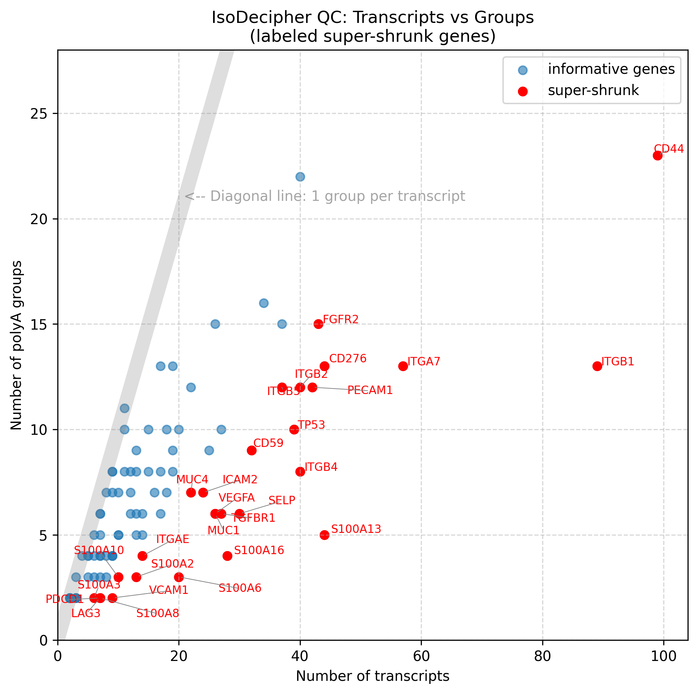

<p>
  
</p>

# IsoDecipher


[](LICENSE)  
[]()  
[]()

**IsoDecipher: Targeted isoform quantification for immune and cancer biology from 3′ scRNA-seq data.**

---

## 🎯 Overview

Most single-cell RNA-seq pipelines (e.g. Cell Ranger, STARsolo) collapse all transcript isoforms into a single **gene count**,  discarding crucial isoform-specific information that reveals cell states and functions.

**IsoDecipher** recovers this biological signal by leveraging 3′ scRNA-seq read patterns to distinguish:

- **Alternative last exons (ALEs)** and **polyadenylation sites (PAS)**  
- **Membrane vs secreted isoforms** in immunoglobulin genes  
- **3′UTR length variation** in immune and cancer-related genes  

💡 Key insight: 3′ scRNA-seq reads contain sufficient information to resolve major isoform classes when analyzed with biological context.what to look for.

---

## 🛠️ Tools Suite


### 1. `build_panel.py` → Annotation
**Purpose:** Builds a **per-transcript annotation table**.

**Output Features:**
- Last exon start/end per transcript  
- 3′UTR length relative to CDS  
- Immunoglobulin short/long classification (`IGHM`, `IGHG1–4`, `IGHA1/2`, `IGHE`)  
- Transcript summary per gene (#transcripts, average UTR length)  

**Use Case:** Understanding isoform landscape before quantification.


---
### 2. `build_panel_features.py`
**Purpose:** Collapses isoforms into **polyA groups** and emits features for BAM quantification.

**Output Features:**
- `polyA_group`: Merged transcript ends within tolerance window
- `last_exon_group`: Last exon coordinates per transcript
- UTR length stats per group (avg, min, max) per group 
- Customizable polyA windows and tolerance, with per-gene overrides  
- Optional filtering of uninformative genes (single-transcript or collapsed groups)  

**Use Case:** Generating features for isoform-aware counting.


---

### 3. `quantify_isoforms_from_bam.py` → Counting
**Purpose:** Assign reads/UMIs to isoform groups from Cell Ranger BAMs  
**Output:**
- Cell × Isoform UMI counts matrices
- Per-cell isoform usage fractions
- Quality control metrics by evidence tier
**Use Case:** Quantifying isoform expression in single-cell data.

---

## 🚀 Quick Start

### Installation
```bash
git clone https://github.com/rene2718/IsoDecipher.git
cd IsoDecipher

conda create -n isodecipher python=3.10
conda activate isodecipher

pip install -r requirements.txt
```

---
### Step 1. Generate Transcript Annotation

```bash
python scripts/build_panel.py \
    --gtf data/Homo_sapiens.GRCh38.115.gtf \
    --genes data/gene_list.txt \
    --out results/isoform_panel.csv    
```
Outputs:
- `results/isoform_panel.csv` 
- `results/isoform_panel_summary.csv`

For immunoglobulin constant region genes, IsoDecipher **auto-labels short vs long (secreted vs membrane) isoforms**.

---
### Step 2. Build Quantification Features

**Usage:**
```bash
python IsoDecipher/build_panel_features.py \
    --gtf Homo_sapiens.GRCh38.115.gtf \
    --genes data/gene_list.txt \
    --out result/panel_features.csv \
    [--custom_params custom.tsv] \
    [--no-skip_singleton] \
    [--no-skip_collapsed]
```

This generates:
- `results/panel_features.csv`
- `results/panel_features_summary.csv`

---
### Step 3. Quantify Isoforms from BAM

```bash
python IsoDecipher/scripts/quantify_isoforms_from_bam.py  \
  --bam /path/to/possorted_genome_bam.bam  \
  --panel data/panel_features.csv  \
  --out_prefix results/iso
```

Output:  
- `results/isoform_cell_x_polyA_counts.csv` — UMI counts per isoform group per cell  
- `results/isoform_cell_x_gene_isoform_fraction.csv` — per-cell isoform fractions  
- `results/isoform_isoform_qc.tsv` — Quality control metrics

---
## ⚙️ Core Concepts

### PolyA Grouping
Transcripts with nearby polyA ends are collapsed into groups and relabel immunoglobulin isoform with features:  

```
IGHM-201 (membrane) → IGHM_long
IGHM-202 (secreted) → IGHM_short
CD44-201, CD44-202, CD44-203 → CD44_polyA1
```
### Immunoglobulin Handling
Automatic labeling of constant region genes:

- IGHM, IGHG1-4, IGHA1-2, IGHE

- -201 transcripts → _short (secreted)

- -202 transcripts → _long (membrane-bound)

- Special handling for IGHG1-203 as short isoform

### Analysis Strategies
Control grouping sensitivity via `--strategy`:  

- **precise** - Strict grouping (20–40bp tolerance)  
- **balanced** - Default (40–60bp tolerance)  
- **sensitive** - Permissive grouping (60–80bp tolerance)  

### Evidence Tiers
- **tier1**: Unique last exon (high confidence)  
- **tier3**: PolyA window only (lower confidence)  

## 🎛️ Advanced Configuration
### Custom Gene Parameters

Creat a TSV/CSV for gene-specific tuning:

```tsv
gene    polyA_window    end_tolerance
CD44    300             80
IGHM    200             20
FN1     250             60
```
Use with
```bash
python IsoDecipher/scripts/build_panel_features.py \
    --custom_params data/custom_params.tsv
```
### Filtering Options

- `--skip_singleton` / `--no-skip_singleton`  
  Skip or include single-transcript genes (default: skip).  

- `--skip_collapsed` / `--no-skip_collapsed`  
  Skip or include genes that collapse into one group (default: skip).  


---
## 📊 Quality Control 

IsoDecipher provides comprehensive QC to assess panel design and groupin effectiveness.

### Outputs
- **`*_summary.csv`** — summary per gene: number of transcripts, number of groups, and status (informative, collapsed, singleton, skipped).  
- **QC plots** (optional):  
  - Histogram of transcript cluster sizes (number of isoforms per group).  
  - Scatterplot of **#transcripts vs #polyA groups**, highlighting “super-shrunk” genes (e.g. CD44, ITGB1, TP53).  

### Interpretation
- **Diagonal trend**: Genes with ~1 group per transcript (not collapsed).  
- **Below diagonal**: Effective grouping (multiple isoforms → few groups)
- **Super-shrunk genes**: Many isoforms → few groups (highlighted in red).  

Below is an example QC visualization showing the relationship between the number of transcripts and the number of polyA groups per gene.  
Genes that are “super-shrunk” (many isoforms collapsed into few groups) are highlighted in red.



---


## 📊 Biological Applications

### Immunology
- B cell maturation — Membrane to secreted immunoglobulin switching

- Plasma cell identification — Dominant secreted isoform expression

- T cell activation — Soluble vs. membrane receptor isoforms (IL2RA, IL7R, TNFRSF1A)

- Exhaustion markers — PDCD1, LAG3, TIGIT isoform usage


### Cancer Biology
- 3′UTR shortening — CD44, VEGFA, MYC in proliferating cells

- Metastasis markers — FN1, VIM, MUC1 isoform switching

- Cell adhesion — CD44 variant expression in tumor microenvironments

- S100 family — Calcium-binding protein isoform dynamics

---

## 📈 Output Interpretation

**Isoform-aware counts:**  

```
cell_id         IGHM_short   IGHM_long   CD44_polyA1
AAACCTACAATGCC       5          12          3
AAACCTGAGCGATG       8           2          7
```

**QC metrics:**  
- Proportion of UMIs assigned by last exon vs polyA window  
- Gene-level isoform fractions per cell  
- Gene coverage — Percentage of cells expressing isoform groups

---

## 🔬 Best Practices

### Workflow Recommandations
- Start small with **IGH genes + CD44** to validate the workflow  
- Use **positive controls** (e.g. Plasma cells majority IGHG-short)  
- Check UMI counts and isoform fractions before scaling up  
- Expand the panel iteratively (immune, cytokines, adhesion, cancer drivers)  
- Validate biologically — Confirm expected cell-type-specific patterns

### Parameter Tuning
- Simple genes and immunoglobulins — Default parameters usually sufficient

- Complex genes (CD44, MUC1) — May require custom tolerance settings

---

## 📂 Repository Structure
```
IsoDecipher/
├──results/
│   ├── isoform_panel.csv
│   ├── isoform_panel_summary.csv
│   ├── panel_features.csv
│   └── panel_features_summary.csv
├── data/
│   ├── gene_list.txt
│   ├── Homo_sapiens.GRCh38.115.gtf
│   └── Homo_sapiens.GRCh38.115.gtf.db
├── IsoDecipher/
|   └── scripts/
│       ├── build_panel.py
│       ├── build_panel_features.py
│       └── quantify_isoforms_from_bam.py
├── notebooks/
│   ├── iso_test.ipynb
│   └── demo_analysis.ipynb
├── docs/
├── README.md
├── LICENSE
└── requirements.txt
```

---
## ❓ Frequently Asked Questions
### Why target specific genes instead of genome-wide?
Targeted approach provides:
- Higher sensitivity for biologically relevant genes

- Interpretable results with clear biological context

- Computational efficiency for focused research questions

- Reduced multiple testing burden in downstream analysis


### How does IsoDecipher handle technical variability?
- Adjustable tolerance parameters per gene

- Multiple evidence tiers for confidence scoring

- Strategy-based grouping to balance sensitivity/specificity

- Custom overrides: Fine-tuninf for specific genes

### Can I use IsoDecipher with other scRNA-seq platforms?
Yes! IsoDecipher works with any 3′ scRNA-seq data that produces BAM files with cell barcode (CB) and UMI (UB) tags.

### Can I customize the gene panel?
Absolutely! Provide your own gene list file with one gene symbol per line. Comments starting with # are ignored.


### What are the system requirements?
- RAM: 8-16 GB for typical gene panels

- Storage: <5 GB for outputs

- Python: 3.10 or higher

- Dependencies: gffutils, pandas, pysam


---
## 🗺️ Roadmap
- [ ] Refine last-exon grouping heuristics  
- [ ] Expand curated panels beyond immune/cancer genes  
- [ ] Integration with genome-wide APA tools (DaPars2, scUTRquant)  
- [ ] Build Scanpy-ready visualization notebooks  
- [ ] Single-cell multiome compatibility
- [ ] Release preprint and benchmark datasets  

---

## 📄 License
MIT License © 2025 Rene Yu-Hong Cheng
