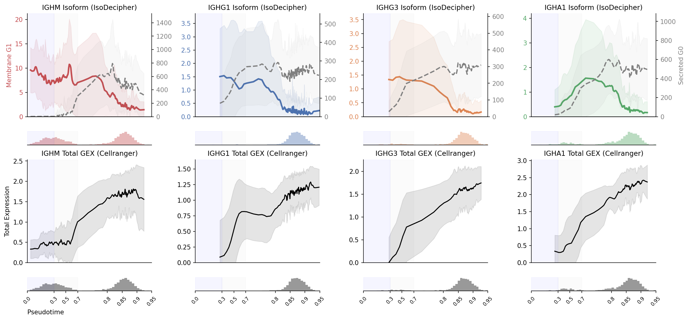
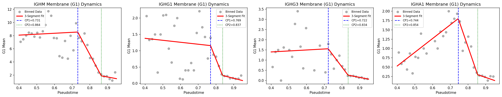
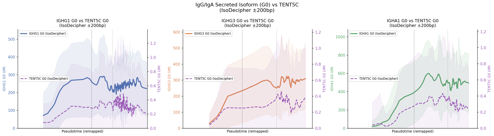

# IsoDecipher

**IsoDecipher** is a targeted isoform quantification tool designed for **3' single-cell RNA-seq (scRNA-seq)** data.

It recovers hidden biological signals—such as **Alternative Polyadenylation (APA)** and **B-cell antibody isoform switching**—by re-interpreting **3' read distributions** that standard pipelines collapse into gene-level counts.

[](LICENSE)
[]()
[]()

---

## Concept

Standard scRNA-seq pipelines collapse transcript isoforms into **gene-level counts**.

```
scRNA-seq reads → Cell Ranger → gene counts (isoform lost)

Cell        IGHM
--------------------
cell_1        12
cell_2        18
cell_3         9
```

IsoDecipher **reinterprets the genomic positions of 3' reads** to recover polyA site usage:

```
Cell      IGHM_G0_Secreted   IGHM_G1_Membrane
----------------------------------------------
cell_1          100                 2
cell_2           4                 14
cell_3          50                  1
```

---

## Why IsoDecipher?

### Comparison with existing tools

| Feature | scAPA | Sierra | MAAPER | IsoDecipher |
|---------|-------|--------|--------|-------------|
| Reference | De novo | De novo | GTF | GTF |
| Feature names | Coordinates | Coordinates | Gene-based | Gene+Group |
| Noise filter | ❌ | ❌ | Partial | ✅ |
| Biotype filter | ❌ | ❌ | ❌ | ✅ |
| NMD option | ❌ | ❌ | ❌ | ✅ |
| Scanpy ready | ❌ | ❌ | ❌ | ✅ |
| IG isoform logic | ❌ | ❌ | ❌ | ✅ |
| Metric selection | Manual | Manual | Manual | Adaptive |

IsoDecipher is the only tool that combines GTF-anchored noise suppression, biotype-aware filtering, biologically interpretable feature naming (gene+group), and adaptive metric selection into a scanpy-compatible output — enabling isoform-resolved single-cell analysis without post-processing.

### 1. Biologically Anchored Noise Suppression
Uses **GTF-derived polyA groups** to filter intronic noise, retain introns, and NMD transcripts. Reduces zero-UTR features from ~47% to under 6%.

### 2. Annotation Quality Filter
- Skips retained introns and NMD transcripts (default; use --include-nmd to retain NMD)
- Skips transcripts with no CDS annotation
- Removes zero-UTR singleton groups: transcripts where the polyA site 
  immediately follows the stop codon (zero 3' UTR length), leaving no 
  other group for comparison — PUI/Entropy cannot be computed
- Always preserves the dominant group per gene, even if all other 
  groups are filtered. Genes with only one remaining group are 
  retained in the panel as raw count features but excluded from 
  PUI/Entropy analysis (reported as "no analysis" in panel summary).
  
### 3. Zero-Ambiguity Strand-Aware Indexing
Group 0 always = proximal polyA site, regardless of genomic strand.

### 4. Adaptive Downstream Metrics

| Groups | Method | Description |
|--------|--------|-------------|
| 2 | **PUI** | log2(G0+1)/(log2(G0+1)+log2(G1+1)) — directional, interpretable. Log-normalization is essential for high-dynamic-range genes such as immunoglobulins, where raw G0/G1 ratios can span several orders of magnitude at terminal differentiation. |
| 3+ | **Entropy** | Shannon entropy of polyA site distribution — order-free, robust |

**NMD transcript handling**: By default, NMD (nonsense-mediated decay) transcripts are excluded. Use `--include-nmd` to include AS-NMD isoforms, which adds +271 features and promotes 14 genes from no-analysis to PUI/Entropy. AS-NMD represents a biologically meaningful post-transcriptional regulatory mechanism particularly relevant for RNA-binding proteins and splicing factors.

Panel summary (with `--include-nmd`):
```
1 group  (no analysis): 48 genes
2 groups (PUI):         67 genes
3+ groups (Entropy):    252 genes
Total features:         1,808
```

### 5. ML-Ready Features
PUI/Entropy features achieve **64% accuracy** (vs 77% for full GEX) in predicting terminal plasma cell commitment using only 40 pure APA features — demonstrating APA captures the majority of cell state information in a 42-fold smaller feature space.

---

## Key Biological Findings

### Figure 1: IgH isoform dynamics along B cell differentiation

IsoDecipher recovers membrane (G1) and secreted (G0) isoforms of immunoglobulin heavy chain transcripts across B cell differentiation for four isotypes (IGHM, IGHG1, IGHG3, IGHA1). The membrane-to-secreted switch arises from APA: G1 utilizes a distal polyadenylation site retaining transmembrane domain exons; G0 uses a proximal site enabling antibody secretion. Cell Ranger total counts increase monotonically across pseudotime for all isotypes, providing no resolution of this transition — IsoDecipher recovers the directionality directly from 3′ BAM files. The G1 decline is a genuine per-cell signal, not a cell-density artifact (minimum n=50 isotype-matched cells per window).

### Figure 2: Quantitative mapping of IgH membrane isoform dynamics


Piecewise linear modeling identifies two conserved changepoints per isotype: G1 downregulation initiates at CP1 (~0.72–0.77) and completes at CP2 (~0.83–0.86), defining a narrow ~0.09–0.13 pseudotime execution window consistent across all isotypes regardless of class-switch identity — suggesting membrane isoform downregulation is triggered at a shared B cell commitment checkpoint. 

Bimodality analysis at the switching window confirms that G1-high and G1-low cells genuinely coexist at this transition (BC > 0.555 across all isotypes: IGHM: 0.624, IGHG1: 0.564, IGHG3: 0.670, IGHA1: 0.565), consistent with a bistable commitment event rather than a continuous gradient. Waddington landscape analysis further confirms progressive energy landscape restructuring across stages — the G1-high attractor destabilizes at CP1 and the G1-low state becomes the sole deep energy well at terminal differentiation, reflecting irreversible plasma cell commitment.

### Figure 3: TENT5C is co-induced with the IgH secreted isoform at plasma cell commitment


DEG analysis on IsoDecipher-defined Before/Switching/Terminal stages identifies TENT5C — a cytoplasmic poly(A) polymerase that stabilizes immunoglobulin heavy chain mRNAs by extending their poly(A) tails — as co-upregulated with the APA switch. By leveraging BCR downregulation as a high-resolution molecular ruler for cell state, IsoDecipher captures a critical commitment transition that total gene count pipelines overlook — and critically, enables downstream trajectory analysis that pinpoints which isoform event TENT5C tracks. Cross-correlation of smoothed pseudotime trajectories confirms TENT5C induction is temporally aligned with G0 upregulation at lag=0 across all class-switched isotypes (IGHG1, IGHG3, IGHA1), not with G1 decline — identifying it as the most directly co-regulated gene with the secreted isoform switch rather than a general plasma cell marker.

Notably, TENT5C (FAM46C) is recurrently mutated in multiple myeloma (~13% of cases) — its specific coupling to the secreted isoform switch during normal plasma cell commitment provides a mechanistic rationale for why its loss dysregulates antibody secretion in malignant plasma cells. Beyond myeloma, pathogenic plasma cells in autoimmune diseases such as SLE and rheumatoid arthritis arise from aberrant passage through this same commitment checkpoint; TENT5C's co-induction with the secreted isoform switch identifies it as a candidate target for selectively disrupting autoreactive plasma cell commitment, complementing terminal plasma cell targeting via BCMA/TNFRSF17 — also identified in the IsoDecipher-defined terminal DEG analysis.

---

## Installation

```bash
mamba create -n iso_decipher python=3.10 -y
mamba activate iso_decipher

```

For pipeline orchestration:
```bash
mamba install -c conda-forge -c bioconda snakemake -y
```

For scGPT validation:
```bash
mamba create -n scgpt_env python=3.10 -y
pip install torch==2.3.0 torchvision torchaudio
pip install torchtext==0.18.0 scgpt scanpy anndata
```

---

## Quick Start

### Step 1: Build isoform feature panel
```bash
# Default (NMD excluded)
python IsoDecipher/scripts/build_panel_features.py \
    --gtf data/Homo_sapiens.GRCh38.115.gtf \
    --genes data/gene_list.txt \
    --out results/panel_features.csv \
    --tolerance 10

# Include NMD transcripts (AS-NMD regulatory isoforms)
python IsoDecipher/scripts/build_panel_features.py \
    --gtf data/Homo_sapiens.GRCh38.115.gtf \
    --genes data/gene_list.txt \
    --out results/panel_features.csv \
    --tolerance 10 \
    --include-nmd
```

### Step 2: Assign reads
```bash
python IsoDecipher/scripts/assign_reads.py \
    --bam data/samples/exp93/possorted_genome_bam.bam \
    --panel results/panel_features.csv \
    --barcodes data/samples/exp93/filtered_feature_bc_matrix/barcodes.tsv.gz \
    --out results/counts/exp93_isoform_count.csv
```

### Step 3: Run full pipeline with Snakemake
```bash
# Default (NMD excluded)
snakemake --cores 4

# Include NMD transcripts
snakemake --cores 4 --config include_nmd=True
```

---

## Data

| Sample | Day | Condition | Cells | Notes |
|--------|-----|-----------|-------|-------|
| exp93 | Day 10 | 2 conditions | 4,631 | |
| exp97 | Day 13 | No IL21 | 7,226 | CITEseq|
| exp105 | Day 13 | CD40L+CpG+IL21 | 7,751 | SECseq|
| exp106 | Day 13 | CD40L+CpG+IL21 | 3,543 | SECseq|

**Final dataset**: 21,670 cells after QC (MT% <15%, 500–5500 genes)

**Features**: GEX 36,691 + Isoform 1,808 (with NMD) + ADT 17

---

## Workflow Overview

```
GTF annotation + gene panel (391 genes)
            │
            ▼
     Panel Builder + Annotation Filter
     (--include-nmd flag for AS-NMD isoforms)
            │
            ▼
   panel_features.csv (1,808 features with NMD / 1,537 without, 367 genes)
            │
            ▼
  Cell Ranger BAM × N samples
            │
            ▼
    IsoDecipher Read Assignment
    (strand-aware, UMI-deduplicated, ±200bp window)
            │
            ▼
  Isoform Count Matrix (cells × polyA_groups)
            │
            ▼
  Integration (GEX + Isoform + ADT → AnnData)
            │
            ▼
  PUI / Entropy Analysis
  ├── APA Trajectory (pseudotime)
  ├── Piecewise Linear Changepoint Detection
  ├── Waddington Landscape
  ├── Isoform-defined DEG staging
  └── TENT5C co-regulation analysis
```


---

## Future Directions 
**[IsoDecipher-GPT](https://github.com/rene2718/isodecipher-gpt)** *(in development)* — a hierarchical BAM-level foundation model that learns APA regulatory grammar directly from raw 3' reads, bypassing GTF annotation entirely. Unlike scGPT or DNABERT, which are bound to fixed gene vocabularies or static DNA sequence, IsoDecipher-GPT tokenizes reads at the polyA signal level (PAS: AATAAA and variants) with single-cell resolution via CB/UB tags — enabling de novo discovery of mutation-driven APA shifts and novel cleavage sites that count-matrix pipelines are structurally incapable of observing.

---

## Gene Panel

IsoDecipher ships with a curated panel of **391 genes** across 22 biological categories, designed for comprehensive oncology-immunology studies including PBMC, B cell differentiation, and cancer datasets (prostate, lung, breast).


### Immunology
- Immunoglobulins (IGHM, IGHG1-4, IGHA1-2, IGHE)
- Plasma cell & secretory pathway (XBP1, MZB1, HSPA5, FKBP11, SSR3, SPCS2...)
- Plasma cell transcription factors (IRF4, PRDM1, PAX5, BCL6...)
- BCR signaling & surface markers (CD79A/B, CD19, CD22, BTK, SYK...)
- T cell markers (CD4, CD8A/B, FOXP3, TOX...)
- Immune checkpoints (CD274/PD-L1, PDCD1, CTLA4, LAG3, TIGIT...)
- SEC-seq discovered markers (CD59, NEAT1, TXNIP, MIF...)

### Oncology — Prostate Cancer
PTEN, AR, RB1, BRCA1, BRCA2, CDK12, PIK3CA, PIK3CB, AKT1, AKT3, MTOR, TSC1, TSC2, STAT5A, STAT5B, JAK1, JAK2, SOCS1, SOCS3, CDK4, CDK6, CCND1, CDKN1B, CDKN2A, ATM, ATR, CHEK2, FOXA1, HOXB13, KLK3, NKX3-1, CXCR4

### Oncology — Lung Cancer
KRAS, NRAS, BRAF, ALK, ROS1, RET, MET, ERBB2, ERBB3, FGFR1, FGFR2, FGFR3, NF1, KEAP1, STK11, SMARCA4, CDKN2A, MDM2, NFE2L2, ARID1A, RBM10, U2AF1, SETD2

### Oncology — Breast Cancer
ESR1, PGR, ERBB2, PIK3CA, PTEN, AKT1, CDKN1B, GATA3, MAP3K1, MAP2K4, TBX3, RUNX1, CBFB, MLL3, NCOR1, SF3B1, SPEN, FOXA1, NF1, RB1, BRCA1, BRCA2, PALB2, CHEK2, CDH1

### Shared Oncology Signatures
- **Oncogenes**: MYC, MYCN, MYCL, MDM2, MDM4, CCNE1, SOX2
- **RTK/Growth factor**: FGFR4, IGF1R, INSR, FLT3, KIT, PDGFRA, PDGFRB, ABL1
- **PI3K/AKT/mTOR**: PIK3CA, PIK3CB, AKT1, AKT3, MTOR, TSC1, TSC2, PTEN
- **JAK/STAT**: JAK1, JAK2, STAT3, STAT5A, STAT5B, SOCS1, SOCS3
- **Apoptosis**: BCL2, BCL6, MCL1, BIRC5 (survivin), XIAP
- **DNA damage & repair**: BRCA1, BRCA2, RAD51, RAD52, FANCD2, ATM, ATR, CHEK2, PALB2
- **Cell cycle**: CDK4, CDK6, CDK12, CCND1, CCNE1, CDKN1B, CDKN2A, RB1
- **Telomere**: TERT, TERC
- **Chromatin remodeling**: ARID1A, SMARCA4, SETD2, MLL3, NCOR1
- **Splicing factors (APA-relevant)**: SF3B1, U2AF1, RBM10
- **Adhesion & EMT**: CD44, VIM, FN1, CDH1, ZEB1/2, TWIST1/2, SNAI1/2
- **Cancer metabolism**: PKM, LDHA, HIF1A, VEGFA
- **S100 family**: S100A1-16, S100B, S100P, S100Z

- Housekeeping controls (ACTB, GAPDH, B2M, UBC, PPIB)
- APA & RNA processing machinery (CSTF1-3, NUDT21, CPSF1-4, SF3B1, U2AF1, RBM10...)

---

## License

MIT License
© 2026 Rene Yu-Hong Cheng
