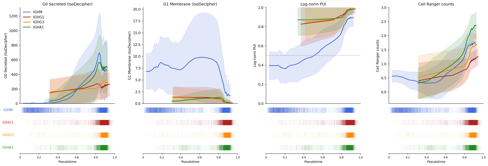
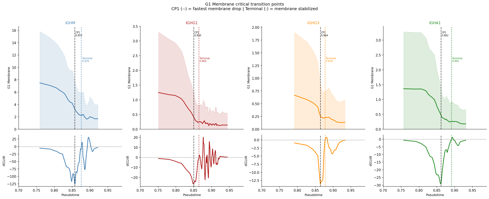

# IsoDecipher

**IsoDecipher** is a targeted isoform quantification tool designed for **3' single-cell RNA-seq (scRNA-seq)** data.

It recovers hidden biological signals—such as **Alternative Polyadenylation (APA)** and **B-cell antibody isoform switching**—by re-interpreting **3' read distributions** that standard pipelines collapse into gene-level counts.

[](LICENSE)
[]()
[]()

---

## Development Status

| Step | Status |
|------|--------|
| Panel builder | ✅ Complete |
| Annotation filter | ✅ Complete |
| Read assignment | ✅ Complete |
| Snakemake pipeline | ✅ Complete |
| Multi-sample integration | ✅ Complete |
| PUI/Entropy analysis | ✅ Complete |
| APA trajectory analysis | ✅ Complete |
| Bifurcation detection | ✅ Complete |
| Critical transition point | ✅ Complete |
| Waddington entropy validation | ✅ Complete |
| APA delta summary (87 genes) | ✅ Complete |
| SHAP / ML analysis | ✅ Complete |
| GNN cell-autonomy analysis | ✅ Complete |
| scGPT foundation model validation | ✅ Complete |
| PBMC public dataset | ⏳ In progress |
| Cancer dataset validation | ⏳ Pending |

---

## Concept

Standard scRNA-seq pipelines collapse transcript isoforms into **gene-level counts**.

```
scRNA-seq reads → Cell Ranger → gene counts (isoform lost)

Cell        IGHM
--------------------
cell_1        12
cell_2        18
cell_3         9
```

IsoDecipher **reinterprets the genomic positions of 3' reads** to recover polyA site usage:

```
Cell      IGHM_G0_Secreted   IGHM_G1_Membrane
----------------------------------------------
cell_1          10                  2
cell_2           4                 14
cell_3           8                  1
```

---

## Key Biological Findings

### 1. IGHM APA Switching — Progressive Trajectory
- PUI increases sigmoidally from ~0.38 (naive/acitvated B cells) to ~0.88 (plasma cells)
- Sliding window bimodality coefficient: BC = 0.632 (window pt=0.70–0.89), confirming bifurcation signal

### 2. APA Commitment Precedes Class Switch Recombination
- IgG/IgA cells enter the observable window with already-high PUI (~0.6–0.9)
- Since all class-switched cells transited through IGHM, APA switching occurred **before** isotype switching
- Membrane isoform counts decline synchronously across all four isotypes at terminal pseudotime — active downregulation, not passive dilution

### 3. Critical Transition Point at Pseudotime ~0.858
- Derivative analysis identifies membrane isoform drop at pt = 0.850–0.865 across all isotypes (range = 0.015)
- G1=0 fraction shows sigmoid jump from ~5% to ~80% at this point
- GEX DE at critical point: **upregulated** — SSR4, FKBP11, SPCS2/3, CD38, XBP1 (ER secretory program); **downregulated** — MS4A1, PAX5, HLA-DRA (B cell identity)
- Bootstrap-stable genes (100 resamples): 71 up, 518 down

### 4. Waddington Landscape Validation
Two distinct APA regulatory programs at terminal commitment:

| Pattern | Genes | Biology |
|---------|-------|---------|
| Converge ↓ | CD59, TMBIM6, IGFLR1 | Terminal cells converge to dominant isoform |
| Diversify ↑ | FKBP11, TXNIP | ER secretory genes maintain isoform diversity |
| Stable → | GAPDH, B2M | Constitutive housekeeping (negative controls) |

### 5. APA is Cell-Autonomous (GNN Analysis)
- MLP (no graph): R²=0.981 for TMBIM6 entropy prediction
- GCN (GEX-based graph): R²=0.368
- GCN (APA-based graph): R²=0.920
- Conclusion: APA regulation is primarily cell-autonomous; GEX-based neighborhood adds noise

### 6. scGPT Foundation Model Validation
- 4000 cells (stratified across 4 samples) embedded with scGPT blood model
- PAGA trajectory from scGPT embedding recapitulates IGHM PUI gradient (PUI 0.4→0.9)
- scGPT (without batch correction) mapped day7 vs day 13 activated B cells into two clusters (scanpy-BBKNN failed)
- XIST-high cluster (cluster 9) identifies female donor cells

### 7. APA Delta Summary — 87 Genes, 4 Patterns
Systematic quantification of APA change across B cell differentiation:
- **32 converge genes**: TMBIM6 (Δ=-0.454), CD59 (Δ=-0.311), IGFLR1, PTMA, MS4A1...
- **12 peak genes**: SSR3, SPCS2, LDHA, HNRNPC (peak at Late, then partial return)
- **20 diversify genes**: TXNIP (Δ=+0.179), FKBP11 (Δ=+0.182), PABPN1...
- **23 stable genes**: GAPDH, B2M, NDUFA4 (negative controls, Δ≈0)

---

## Why IsoDecipher?

### 1. Biologically Anchored Noise Suppression
Uses **GTF-derived polyA groups** to filter intronic noise, retain introns, and NMD transcripts. Reduces zero-UTR features from ~47% to under 6%.

### 2. Annotation Quality Filter
- Skips retained introns, NMD, CDS-not-defined transcripts
- Removes zero-UTR singleton groups
- Always preserves dominant group

### 3. Zero-Ambiguity Strand-Aware Indexing
Group 0 always = proximal polyA site, regardless of genomic strand.

### 4. Adaptive Downstream Metrics

| Groups | Method | Description |
|--------|--------|-------------|
| 2 | **PUI** | log2(G0+1)/(log2(G0+1)+log2(G1+1)) — directional, interpretable |
| 3+ | **Entropy** | Shannon entropy of polyA site distribution — order-free, robust |

PSI (Proximal Shift Index) was removed as it assumes linear proximal→distal ordering across groups, which is not guaranteed by GTF annotation. Shannon Entropy makes no ordering assumption and is applicable to all multi-group genes.

### 5. ML-Ready Features
PUI/Entropy features achieve **64% accuracy** (vs 77% for full GEX) in predicting terminal plasma cell commitment using only 40 pure APA features — demonstrating APA captures the majority of cell state information in a 42-fold smaller feature space.

---

## Installation

```bash
mamba create -n iso_decipher python=3.10 -y
mamba activate iso_decipher

pip install gffutils pysam pandas numpy scanpy anndata \
            matplotlib seaborn scipy scikit-learn shap
```

For pipeline orchestration:
```bash
mamba install -c conda-forge -c bioconda snakemake -y
```

For scGPT validation:
```bash
mamba create -n scgpt_env python=3.10 -y
pip install torch==2.3.0 torchvision torchaudio
pip install torchtext==0.18.0 scgpt scanpy anndata
```

---

## Quick Start

### Step 1: Build isoform feature panel
```bash
python IsoDecipher/scripts/build_panel_features.py \
    --gtf data/Homo_sapiens.GRCh38.115.gtf \
    --genes data/gene_list.txt \
    --out results/panel_features_v2.csv
```

### Step 2: Assign reads
```bash
python IsoDecipher/scripts/assign_reads.py \
    --bam data/samples/exp93/possorted_genome_bam.bam \
    --panel results/panel_features.csv \
    --barcodes data/samples/exp93/filtered_feature_bc_matrix/barcodes.tsv.gz \
    --out results/counts/exp93_isoform_count.csv
```

### Step 3: Run full pipeline with Snakemake
```bash
snakemake --cores 4
```

---

## Data

| Sample | Day | Condition | Cells | Notes |
|--------|-----|-----------|-------|-------|
| exp93 | Day 10 | 2 conditions | 4,631 | | Rene's condition and Rene's mod condition wo CpG
| exp97 | Day 13 | CD40L+CpG+comboNoIL21 | 7,226 | |
| exp105 | Day 13 | CD40L+CpG+IL21 | 7,751 | Rene's condition |
| exp106 | Day 13 | CD40L+CpG+IL21 | 3,543 | Rene's condition |

**Final dataset**: 21,670 cells after QC (MT% <15%, 500–5500 genes)

**Features**: GEX 36,330 + Isoform 858 + ADT 17

---

## Workflow Overview

```
GTF annotation + gene panel (391 genes)
            │
            ▼
     Panel Builder + Annotation Filter
            │
            ▼
   panel_features_v2.csv (1329 features, 367 genes)
            │
            ▼
  Cell Ranger BAM × N samples
            │
            ▼
    IsoDecipher Read Assignment
    (strand-aware, UMI-deduplicated, ±200bp window)
            │
            ▼
  Isoform Count Matrix (cells × polyA_groups)
            │
            ▼
  Integration (GEX + Isoform + ADT → AnnData)
            │
            ▼
  PUI / Entropy Analysis
  ├── APA Trajectory (pseudotime)
  ├── Bifurcation Detection (BC > 0.555)
  ├── Critical Transition Point (derivative)
  ├── Waddington Entropy Landscape
  ├── SHAP Feature Importance
  ├── GNN Cell-Autonomy Analysis
  └── scGPT Foundation Model Validation
```

---

## Figure Roadmap (Current)

| Figure | Content | Status |
|--------|---------|--------|
| Figure 1 | Tool overview, IGHM example | ⏳ |
| Figure 2 | IGH APA trajectory + class-switched IG show PUI delay | ✅ |
| Figure 3 | Critical transition point (BC, derivative, G1=0 fraction) | ✅ |
| Figure 4 | Critical points stage analysis | ✅ |
| Figure 5 | MORE IN PROGRESS 
| Supp | scGPT foundation model validation (UMAP, PAGA, DPT) | ✅ |
| NEXT analysis| PBMC validation, cancer dataset | ⏳ |

### Results Gallery



---

## Future Directions

Develop an **isoform-aware foundation model** trained on IsoDecipher-quantified APA profiles across normal differentiation trajectories. Such a model could identify oncogenic APA deviations by comparing tumor cell isoform landscapes to the normal differentiation reference established here.

Extended approach: **BAM-level tokenization** incorporating polyA signal sequence context (PAS: AATAAA and variants, AU-rich elements, ±200bp window) to detect mutation-driven APA changes and novel unannotated polyA sites in tumor samples.

---

## Gene Panel

IsoDecipher ships with a curated panel of **391 genes** across 22 biological categories, designed for comprehensive oncology-immunology studies including PBMC, B cell differentiation, and cancer datasets (prostate, lung, breast).

### Core Biology
- Housekeeping controls (ACTB, GAPDH, B2M, UBC, PPIB)
- Immunoglobulins (IGHM, IGHG1-4, IGHA1-2, IGHE)
- Plasma cell & secretory pathway (XBP1, MZB1, HSPA5, FKBP11, SSR3, SPCS2...)
- Plasma cell transcription factors (IRF4, PRDM1, PAX5, BCL6...)
- APA & RNA processing machinery (CSTF1-3, NUDT21, CPSF1-4, SF3B1, U2AF1, RBM10...)
- BCR signaling & surface markers (CD79A/B, CD19, CD22, BTK, SYK...)
- T cell markers (CD4, CD8A/B, FOXP3, TOX...)
- Immune checkpoints (CD274/PD-L1, PDCD1, CTLA4, LAG3, TIGIT...)
- SEC-seq discovered markers (CD59, NEAT1, SDC1, TXNIP, MIF...)

### Oncology — Prostate Cancer
PTEN, AR, RB1, BRCA1, BRCA2, CDK12, PIK3CA, PIK3CB, AKT1, AKT3, MTOR, TSC1, TSC2, STAT5A, STAT5B, JAK1, JAK2, SOCS1, SOCS3, CDK4, CDK6, CCND1, CDKN1B, CDKN2A, ATM, ATR, CHEK2, FOXA1, HOXB13, KLK3, NKX3-1, CXCR4

### Oncology — Lung Cancer
KRAS, NRAS, BRAF, ALK, ROS1, RET, MET, ERBB2, ERBB3, FGFR1, FGFR2, FGFR3, NF1, KEAP1, STK11, SMARCA4, CDKN2A, MDM2, NFE2L2, ARID1A, RBM10, U2AF1, SETD2

### Oncology — Breast Cancer
ESR1, PGR, ERBB2, PIK3CA, PTEN, AKT1, CDKN1B, GATA3, MAP3K1, MAP2K4, TBX3, RUNX1, CBFB, MLL3, NCOR1, SF3B1, SPEN, FOXA1, NF1, RB1, BRCA1, BRCA2, PALB2, CHEK2, CDH1

### Shared Oncology Signatures
- **Oncogenes**: MYC, MYCN, MYCL, MDM2, MDM4, CCNE1, SOX2
- **RTK/Growth factor**: FGFR4, IGF1R, INSR, FLT3, KIT, PDGFRA, PDGFRB, ABL1
- **PI3K/AKT/mTOR**: PIK3CA, PIK3CB, AKT1, AKT3, MTOR, TSC1, TSC2, PTEN
- **JAK/STAT**: JAK1, JAK2, STAT3, STAT5A, STAT5B, SOCS1, SOCS3
- **Apoptosis**: BCL2, BCL6, MCL1, BIRC5 (survivin), XIAP
- **DNA damage & repair**: BRCA1, BRCA2, RAD51, RAD52, FANCD2, ATM, ATR, CHEK2, PALB2
- **Cell cycle**: CDK4, CDK6, CDK12, CCND1, CCNE1, CDKN1B, CDKN2A, RB1
- **Telomere**: TERT, TERC
- **Chromatin remodeling**: ARID1A, SMARCA4, SETD2, MLL3, NCOR1
- **Splicing factors (APA-relevant)**: SF3B1, U2AF1, RBM10
- **Adhesion & EMT**: CD44, VIM, FN1, CDH1, ZEB1/2, TWIST1/2, SNAI1/2
- **Cancer metabolism**: PKM, LDHA, HIF1A, VEGFA
- **S100 family**: S100A1-16, S100B, S100P, S100Z

---

## License

MIT License
© 2026 Rene Yu-Hong Cheng
